# TRUDUtilsD365

A set of Visual Studio Add-ins for Microsoft Dynamics 365 for Finance and Operations that will allow you to perform quickly common development tasks.

* [Create extension class](#create-extension-class)
* [Copy extension method](#copy-extension-method)
* [Create extension](#create-extension)
* [Enum builder](#enum-builder)
* [Fields builder](#fields-builder)
* [Table builder](#table-builder)
* [Form builder](#form-builder)
* [RunBase class builder](#runbase-class-builder)
* [DataContract class builder](#datacontract-class-builder)
* [Create find method](#create-find-method)
* [Create menu item](#create-menu-item)
* [Create security privilege](#create-security-privilege)
* [Relation to Xpp](#relation-to-xpp)
* [Create table relation](#create-table-relation)
* [Troubleshooting](#troubleshooting)
* [Installation](#installation)

You are more than welcome to contribute!

## Create extension class

This Add-in works for standard Tables, Classes, Forms, Forms DS and Controls and allows you to create an extension class in one click.

What you need to do is to enter your project prefix

It also allow you to follow naming conventions. The following standard is proposed

| Standard element name       | Extension Class Name                                         |
| --------------------------- | ------------------------------------------------------------ |
| Table CustTable             | [ExtensionOf(tablestr(CustTable))]<br/>final class CustTableTST_Extension |
| View AssetBalances          | [ExtensionOf(viewstr(AssetBalances))]<br/>final class AssetBalancesTST_Extension |
| DataEntity AccountantEntity | [ExtensionOf(dataentityviewstr(AccountantEntity))]<br/>final class AccountantEntityTST_Extension |
| Map CustVendTable           | [ExtensionOf(mapstr(CustVendTable))]<br/>final class CustVendTableTST_Extension |
| Form CustTable              | [ExtensionOf(formstr(CustTable))]<br/>final class CustTableFormTST_Extension |
| Form data source            | [ExtensionOf(formdatasourcestr(CustTable, DataSource1))]<br/>final class CustTableFormTST_DataSource1_Extension |
| Form data fields            | [ExtensionOf(formdatafieldstr(CustTable, DataSource1, Field1))]<br/>final class CustTableFormTST_DataSource1Field1_Extension |
| Button1                     | [ExtensionOf(formcontrolstr(CustTable, Button1))]<br/>final class CustTableFormTST_Button1_Extension |

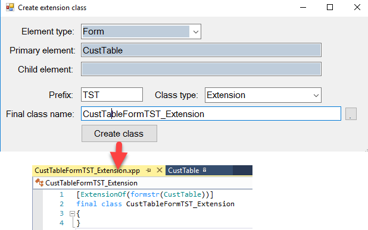

You can also setup your own naming convention rules. See [this](https://denistrunin.com/d365utils-classextensionname/) article for this details.

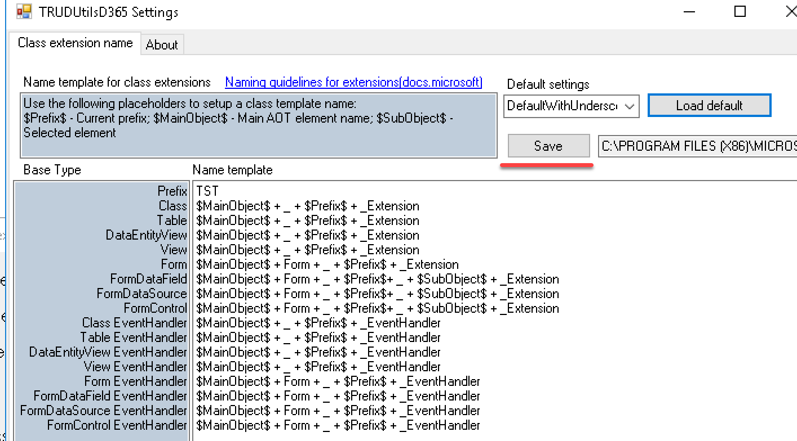

This tool can be run using Right-click AddIns on Table, Class or Form..

## Copy extension method

This Addins copies to the clipboard template for the method extension(with next call)

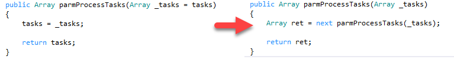

Tool can be run by Right-click method in the designer view

## Create extension

This Addins creates an extension for the element from the designer view(standard tool allows to do it only from the Application Explorer)

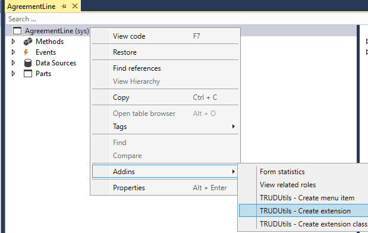

Tool can be run by Right-click object in the designer view

## Enum builder

Used for quick enum creation

The tool does the following:

* Generates an enum
* Adds values with labels from the text entry form(tries to generate element Name from the label automatically or you can specify it manually)
* Generates EDT type for this enum

  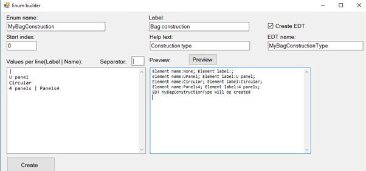

You can run this tool from Main menu **Dynamics 365 - Addins**

## Fields builder

Prepare your fields in Excel and add them to the table(or table extension) in one click.

Usually while adding new fields you have some specification document for the development task and can just Copy-Paste from this document to this tool. Also Excel functions can be used to auto-generate the names(like generate SlitWidth for "Slit width" label)

The tool does the following:

* Creates EDT if it doesn't not exist (Label, Help text, Extends and String length properties supported)
* Adds a field or an empty display method with this EDT to the table
* Adds a new field or a method to the specified Field group
* Creates a relation for the table if EDT has a Reference table property

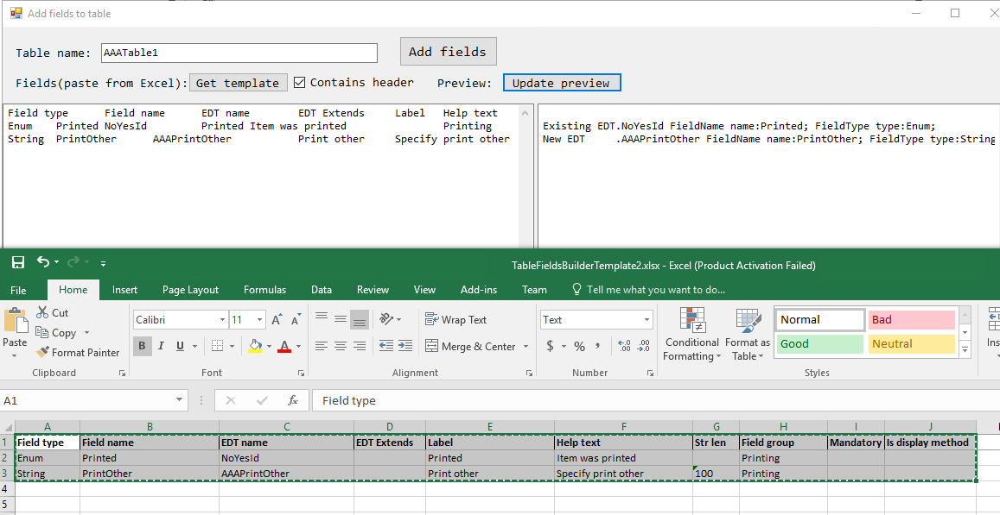

This tool can be run using Right-click AddIns on Table or Table extension object

## Table builder

The tool helps you create a basic dictionary table (table with ID and Description fields based on "Simple list" template)

The tool does the following:

* Creates a new EDT
* Creates a new table with 2 fields ("Key field name" and Description)
* Adds a reference for the EDT with this table
* Adds "find" method for the table, adds Overview group and some default properties
* Creates a form with this table as a data source and  adds all required controls for the "Simple list" template(you need manually specify template after creation)
* Creates a new menu item for this form
* Creates privileges


## Form Builder

This tool helps you create a standard form for the selected table

The tool does the following:

* Creates field groups on the selected table
* Creates a new form
* Adds all required controls based on the selected template (you need to restore the form and manually apply the template after the creation)
* Creates a Menu item for the created form

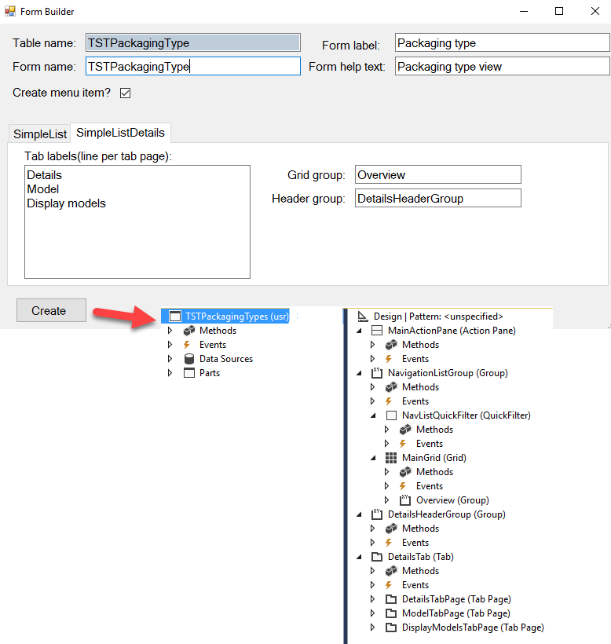

## RunBase class builder

Add-in generates code template for the RunBaseBatch class

Supports the following options:

* Multiple dialog parameters
* Caller record handling
* Query usage
* File upload control(with CSV and Excel [support](https://denistrunin.com/xpptools-readexcelfile/))

See detailed description at [RunBase template class builder](https://denistrunin.com/runbasebuilder-util/)


## DataContract class builder

Add-in generates template code for the DataContract class(used in SysOperation framework)

Supports the following properties:

* Mandatory
* Groups
* Label and Help text override

Also can generate a code template for Data provider and [Controller](https://denistrunin.com/d365utils-generatedp/) 

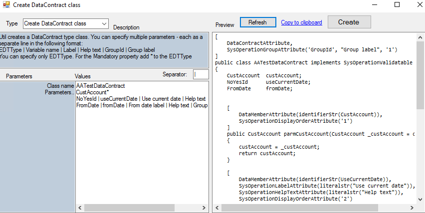

## Create find method

For this Add-in you will need to select several fields(for the table or table extension)

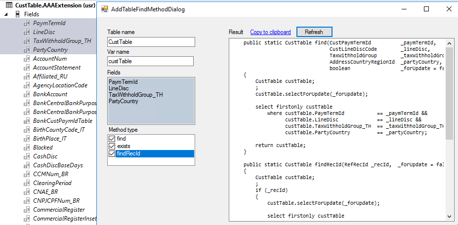

Text for the standard **find()**, **findRecId()** and **exists()** will be generated

## Create menu item

This Add-in works for Forms, Reports and Classes and creates Menu item for the selected object

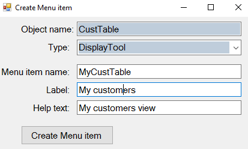

## Create security privilege

This Add-in works for the selected Menu Item and creates new security privilege for this Menu Item. Label and Name are automatically updated when you change Access Level

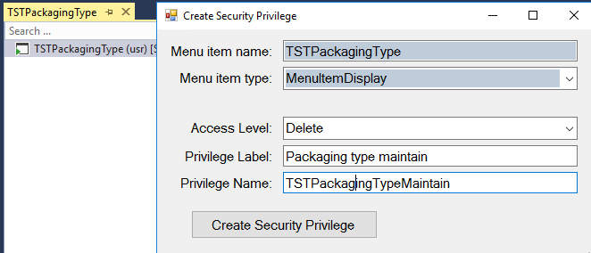

## Relation to Xpp

This Add-in works for the selected table relation and produces X++ code to implement this relation. Code can be generated as "select" or "query" statement

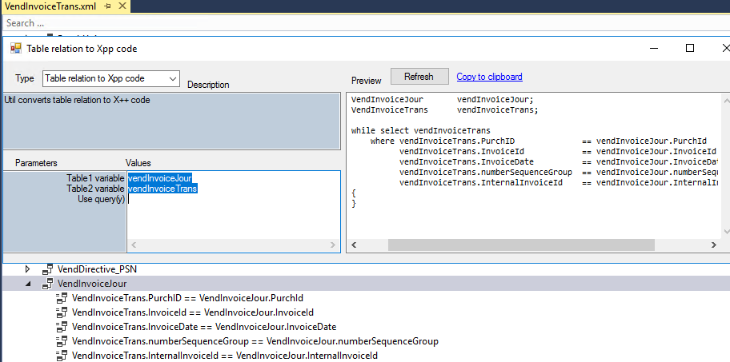

## Create table relation

Add-in creates table relation for the selected table/table-extension field based on the field EDT relation


## Troubleshooting

Current solution was tested on v10 U24.

All tools require that you have an active project with your current model. The first project in the solution is used.

Only basic data validation is currently implemented. In case of any problem try to debug an issue.

One of the ways to do this:

* Download and install dnSpy debugger [dnSpy]: https://github.com/0xd4d/dnSpy
* Run **dnSpy-x86.exe** file and open **TRUDUtilsD365.dll** from the VS AddinExtensions folder
* Set the required breakpoints. Most of the logic located in ..Parms classes
* Go to main menu Debug - Attach to process and choose Visual Studio with D365 project
* Run Add-in in VS. The debugger should pop up

  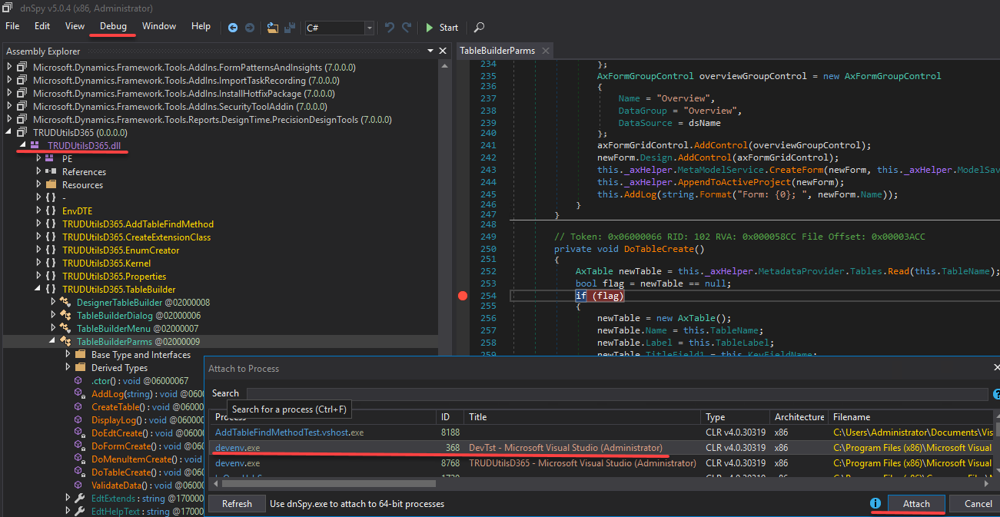

Another option (this will run a new instance of VS)

* Open the solution and set the required breakpoints
* Got to the Project->Property->Debug (for TRUDUtilsD365 project)
* Set start action to "start external program" and specify the parameter "C:\Program Files (x86)\Microsoft Visual Studio\2019\Professional\Common7\IDE\devenv.exe"
* Run the project

## Installation

### Using Power Shell

```powershell
$repo = "TrudAX/TRUDUtilsD365"
$releases = "https://api.github.com/repos/$repo/releases"
$path = "C:\AAA"

If(!(test-path $path))
{
    New-Item -ItemType Directory -Force -Path $path
}
cd $path

Write-Host Determining latest release
[Net.ServicePointManager]::SecurityProtocol = [Net.SecurityProtocolType]::Tls12
$tag = (Invoke-WebRequest -Uri $releases -UseBasicParsing | ConvertFrom-Json)[0].tag_name

$files = @("InstallToVS.exe",  "TRUDUtilsD365.dll",  "TRUDUtilsD365.pdb")

Write-Host Downloading files
foreach ($file in $files) 
{
    $download = "https://github.com/$repo/releases/download/$tag/$file"
    [Net.ServicePointManager]::SecurityProtocol = [Net.SecurityProtocolType]::Tls12
    Invoke-WebRequest $download -Out $file
    Unblock-File $file
}
Start-Process "InstallToVS.exe" -Verb runAs
```

### Manual installation

Download all 3 files from the [Releases](https://github.com/TrudAX/TRUDUtilsD365/releases). Unblock .dll and .exe files(via the file Properties). Run **InstallToVS.exe**(Run as Administrator). It will copy **TRUDUtilsD365.dll** and **TRUDUtilsD365.pdb** to the VS AddinExtensions folders.

Restart VS

You can also copy these files manually, but extension path will be different for different VMs. (for 8.0 local DEV VM it will be C:\Program Files (x86)\Microsoft Visual Studio 14.0\Common7\IDE\Extensions\agk3do44.e2i\AddinExtensions, for 8.1 local DEV VM: C:\Program Files (x86)\Microsoft Visual Studio 14.0\Common7\IDE\Extensions\ugjn0jrw.pfb\AddinExtensions, for 10.0.5 local DEV VM: C:\Program Files (x86)\Microsoft Visual Studio 14.0\Common7\IDE\Extensions\nmjrsprb.nva\AddinExtensions
10.0.11 local DEV VM: C:\Program Files (x86)\Microsoft Visual Studio 14.0\Common7\IDE\Extensions\uhv05n1m.te4
)

The path is controlled by the following system variables: DynamicsVSTools, DynamicsVSToolsHintPath

For VM without admin access(above PU25) use the following approach: In your documents folder there is a dynamics dev config XML file.

```xml
 <?xml version="1.0" encoding="utf-8"?> <DynamicsDevConfig xmlns:i="http://www.w3.org/2001/XMLSchema-instance" xmlns="http://schemas.microsoft.com/dynamics/2012/03/development/configuration"> 	    
  <AddInPaths xmlns:d2p1="http://schemas.microsoft.com/2003/10/Serialization/Arrays"> 		 
      <d2p1:string>C:\D365CustomAddins</d2p1:string> 	
  </AddInPaths>   
</DynamicsDevConfig> 
```
