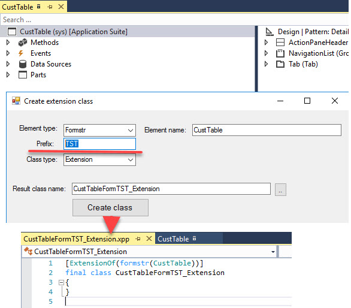
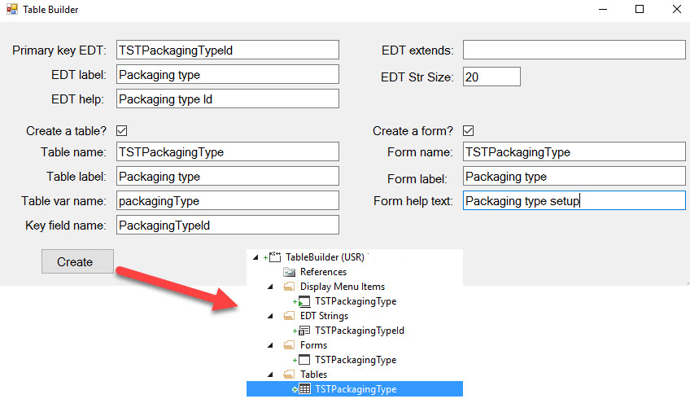

# TRUDUtilsD365
A set of Visual Studio Add-ins for Microsoft Dynamics 365 for Operation that will allow you to perform quickly common development tasks. 

* [Create extension class](#create-extension-class)
* [Copy extension method](#copy-extension-method)
* [Enum builder](#enum-builder)
* [Fields builder](#fields-builder)
* [Table builder](#table-builder)
* [Create menu item](#create-menu-item)
* [Troubleshooting](#troubleshooting)
* [Installation](#installation)

You are more than welcome to contribute! 

## Create extension class

This Add-in works for standard Forms, Tables and Classes and allows you to create an extension class in one click.

What you need to do is to enter your project prefix

This tool can be run using Right-click AddIns on Table, Class or Form(other elements are coming) 

## Copy extension method

This Addins copies to the clipboard template for the method extension(with next call)

Tool can be run by Right-click method in the designer view

## Enum builder

Used for quick enum creation

The tool does the following:

- Generates an enum

- Adds values with labels from the text entry form(tries to generate element Name from the label automatically or you can specify it manually)

- Generates EDT type for this enum

  

You can run this tool from Main menu **Dynamics 365 - Addins** 

## Fields builder

Prepare your fields in Excel and add them to the table(or table extension) in one click. 

Usually while adding new fields you have some specification document for the development task and can just Copy-Paste from this document to this tool. Also Excel functions can be used to auto-generate the names(like generate SlitWidth for "Slit width" label) 

The tool does the following:

- Creates EDT if it doesn't not exist (Label, Help text, Extends and String length properties supported)
- Adds a field or an empty display method with this EDT to the table
- Adds a new field or a method to the specified Field group
- Creates a relation for the table if EDT has a Reference table property

This tool can be run using Right-click AddIns on Table or Table extension object

## Table builder

The tool helps you create a basic dictionary table (table with ID and Description fields based on "Simple list" template)

The tool does the following:

- Creates a new EDT
- Creates a new table with 2 fields ("Key field name" and Description)
- Adds a reference for the EDT with this table
- Adds "find" method for the table, adds Overview group and some default properties
- Creates a form with this table as a data source and  adds all required controls for the "Simple list" template(you need manually specify template after creation)
- Creates a new menu item for this form

## Create menu item

This Add-in works for Forms, Reports and Classes and creates Menu item for the selected object

## Troubleshooting

Current solution was tested on 8.0U15.

All tools require that you have an active project with your current model. The first project in the solution is used.

Only basic data validation is currently implemented. In case of any problem try to debug an issue. 

One of the ways to do this:

- Download and install dnSpy debugger [dnSpy]: https://github.com/0xd4d/dnSpy

- Run **dnSpy-x86.exe** file and open **TRUDUtilsD365.dll** from the VS AddinExtensions folder

- Set the required breakpoints. Most of the logic located in ..Parms classes

- Go to main menu Debug - Attach to process and choose Visual Studio with D365 project

- Run Add-in in VS. The debugger should pop up

  

​      

Another option (this will run a new instance of VS)

- Open the solution and set the required breakpoints
- Got to the Project->Property->Debug (for TRUDUtilsD365 project)
- Set start action to "start external program" and specify the parameter "C:\Program Files (x86)\Microsoft Visual Studio 14.0\Common7\IDE\devenv.exe"
- Run the project

## Installation

Download all 3 files and run InstallToVS.exe. It will copy TRUDUtilsD365.dll and TRUDUtilsD365.pdb to the VS AddinExtensions folders.

Restart VS

You can also copy these files manually, but extension path will be different for different VMs. (for 8.0 local DEV VM it will be C:\Program Files (x86)\Microsoft Visual Studio 14.0\Common7\IDE\Extensions\agk3do44.e2i\AddinExtensions, for 8.1 local DEV VM: C:\Program Files (x86)\Microsoft Visual Studio 14.0\Common7\IDE\Extensions\ugjn0jrw.pfb\AddinExtensions )

